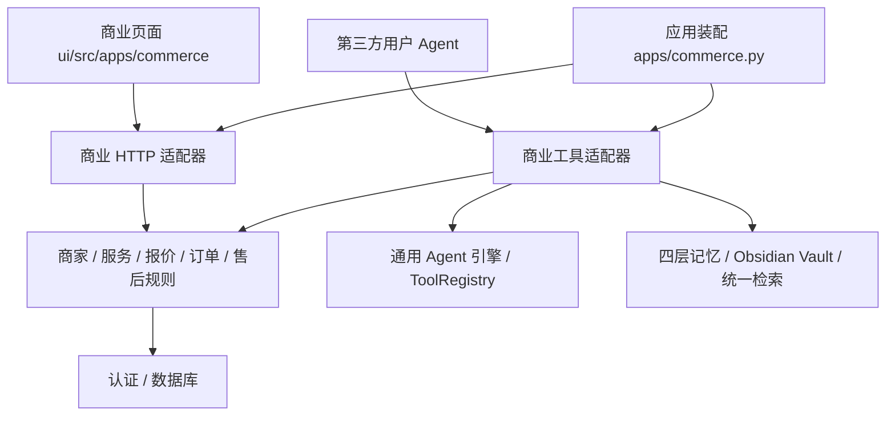

# 底座与商业应用分离

更新日期：2026-10-03。底座能力必须与应用层分开，这是项目的长期约束。

## 依赖方向

业务应用调用底座，底座不导入商业应用。模型能力强弱、商业场景变化和新增客户端，都不应导致通用引擎内出现商家、订单或收费判断。

| 层 | 目录 | 职责 |
| --- | --- | --- |
| 通用 Agent 底座 | `agent/`、`application/` | 对话循环、工具协议、会话、身份、编排与事件 |
| 通用记忆与检索 | `memory/`、`retrieval/` | 四层记忆、用户隔离、Obsidian 兼容 Vault 和上下文检索 |
| 通用基础设施 | `core/auth/`、`db/`、`tools/` | 账号认证、持久化和工具运行设施 |
| 商业业务应用 | `merchants/`、`catalog/`、`commerce/` | 商家权限、公开服务、报价、用户确认预约、履约、账单、退款与售后 |
| 商业系统接入 | `integrations/` | 商家目录契约、订单投递、持久化投递记录和重试 |
| 应用装配 | `apps/commerce.py`、`main.py` | 选择并装配业务路由，默认不注入支付服务商或模型客户端 |
| 商业 UI | `ui/src/apps/commerce/` | 页面、表单、导航、接口客户端和样式；根 App 只注册应用路由 |

历史 ADR 中 `application/` 的名称代表共享编排底座，不代表商家业务应用。不要把商业模块移入该目录。

## 具体约束

- `agent/engine.py` 不认识商家、报价、订单状态、抽佣或退款。
- `application/` 中不注册全局用户绑定的商业工具闭包。`commerce/agent_tools.py` 每次按当前用户与授权创建工具集。
- `commerce/engine.py` 是商业应用对底座的装配：注入工具、业务提示和用户自己的记忆检索。构造时不调用模型；底座无商业专用分支。
- `catalog/service.py` 提供共享服务查询；`commerce/service.py` 提供预约规则。REST 路由与 Agent 调用这些服务，不互相调用 HTTP 路由函数。
- 客户端负责显示确认表单，服务端执行权限、报价变化检查、确认要求、幂等与订单状态迁移。
- Obsidian 位于通用 `memory/`，第四层仍是程序性记忆。商业 UI 只是一个入口，不持有 Vault 存储实现。
- `integrations/` 的通用商家契约属于商业接入，不直接加入通用 LLM 工具执行器。
- 支付和商家系统客户端由部署装配显式提供；测试使用本地实现或 MockTransport。

标准 API 默认装配商业应用。仅运行通用底座时设置 `OPENAGENTIC_COMMERCE_ENABLED=0`，或调用 `create_app(commerce_enabled=False)`；认证、记忆、Agent 等原有接口继续保留。迁移工具仍导入所有 ORM 模型，以维持完整、稳定的数据库迁移历史；关闭应用不删除已有商业表或数据。

`tests/merchants/test_layer_boundaries.py` 检查底座模块不得导入商业模块，并验证关闭商业应用后底座接口仍在。新业务应用应沿用这个单向依赖规则。
